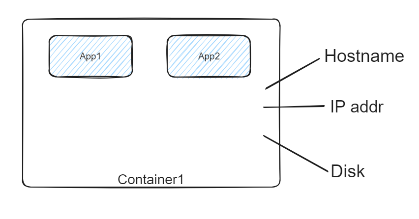
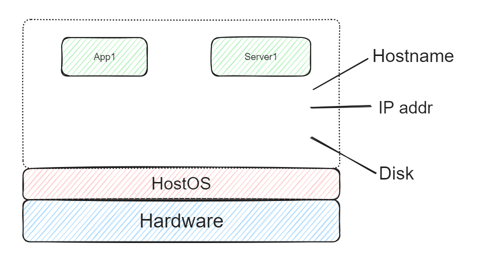
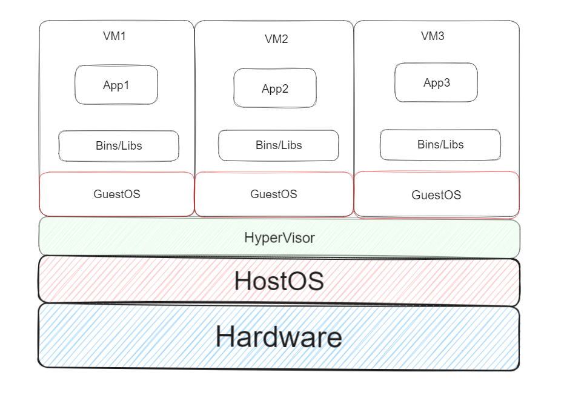
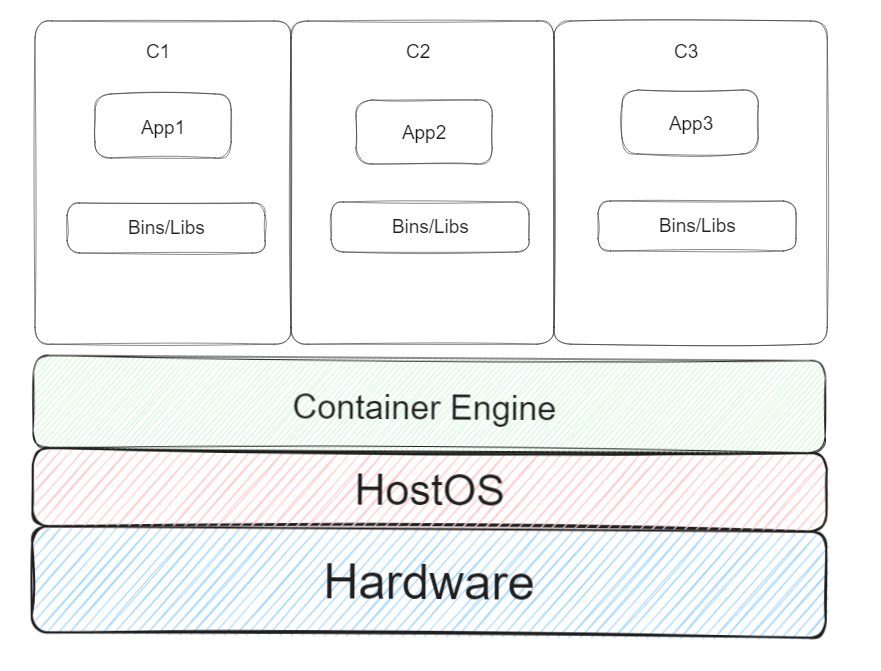

## **容器**

容器技术是一种虚拟化技术，提供了对代码运行的隔离环境。这种隔离环境使得容器内部的应用程序可以独立运行，无需关心底层操作系统或文件系统的具体细节。容器包含了应用程序运行所需的所有组件，甚至包括基本的操作系统组件。

容器的独立性和轻量级特性使得它们具有快速启动、停止和移动的能力，极大地提高了应用程序的部署效率和管理便利性。这种优势使得容器在微服务架构和持续集成/持续部署（CI/CD）流程中广泛应用，成为部署和管理现代应用程序的理想选择。

## **部署方式的发展**

### 物理部署
**特点**
- 使用实际物理硬件进行部署，每台服务器运行一个操作系统实例。
- 物理资源独立分配，每台服务器运行一个应用或服务。

**优点**
- 最大的隔离性和安全性。
- 对于计算密集型、高性能需求的应用有较好的性能。

**缺点**
- 资源利用率低，硬件成本高。
- 部署和扩展不灵活，维护成本高。

### 虚拟机部署
**特点**
- 使用虚拟化软件在物理服务器上创建多个虚拟机，每个虚拟机运行一个操作系统实例。
- 资源通过虚拟化技术划分，可以在一台物理服务器上运行多个应用或服务。

**优点**
- 更高的资源利用率，降低硬件成本。
- 可以灵活部署、迁移和扩展虚拟机。

**缺点**
- 相对于物理部署，虚拟化会带来一定的性能损耗。
- 虚拟机隔离性和安全性略低于物理部署。

**案例**
使用VMware或Hyper-V等虚拟化软件在一台物理服务器上创建多个虚拟机，每个虚拟机运行不同的操作系统和应用程序。

### 容器部署
**特点**
- 使用容器技术在宿主机上创建多个容器，每个容器运行一个应用程序。
- 容器共享宿主机的内核和部分系统资源，轻量级且快速启动。

**优点**
- 更高的资源利用率，轻量级且启动速度快。
- 容器之间资源共享，节省资源开销。
- 可以快速部署、迁移和扩展容器。

**缺点**
- 相对于虚拟机，容器隔离性和安全性稍低。

**案例**
使用Docker等容器技术，在一台物理服务器或虚拟机上创建多个容器，每个容器运行不同的应用程序或服务。

## **容器和虚拟机的特点和区别**

### 虚拟机（Virtual Machine）

**发展历史**
- 起源于上世纪60年代的主机虚拟化，由 IBM 公司推出。
- 随着硬件技术和虚拟化软件（如VMware、Xen等）的发展，得到广泛应用。

**特点**
- 完全虚拟化：在物理硬件上创建完整的虚拟环境，每个虚拟机都有自己的操作系统和应用程序。
- 资源隔离：虚拟机之间资源完全隔离，一个虚拟机的故障不会影响其他虚拟机。
- 高隔离性和安全性：适用于多租户环境和安全要求较高的场景。

### 容器（Container）

**发展历史**
- 起源于类似于 chroot 的隔离技术，现代化发展始于 Linux 容器（LXC）和 Docker 等技术。
- Docker 于2013年发布，推动了容器技术的普及。

**特点**
- 轻量级虚拟化：共享宿主机的内核和部分系统资源，相比虚拟机更加轻量级。
- 资源共享：多个容器可以共享宿主机的资源，节省了资源开销。
- 快速启动和部署：适用于快速迭代和持续集成部署的场景。
- 适用于微服务架构：每个容器可承载一个服务或应用程序，适用于微服务架构和持续集成部署。

### 容器和虚拟机的区别

容器和虚拟机是封装计算环境的两种方式，其中整合了各种 IT 组件并将其与系统的其他部分隔离开来。二者之间的主要区别在于隔离了哪些组件，这反过来又影响了每种方式的规模和可移植性。

**隔离性**
- 虚拟机具有更高的隔离性，每个虚拟机拥有独立的操作系统和虚拟硬件。
- 容器共享宿主机的内核和资源，隔离性相对虚拟机较低。

**资源利用**
- 虚拟机资源开销较大，容器资源利用更加高效。

**启动速度和部署**
- 虚拟机启动较慢，容器启动速度快。

**适用场景**
- 虚拟机适用于需要较高隔离性和安全性的场景。
- 容器适用于轻量级、快速迭代的应用部署，特别适用于微服务架构。
