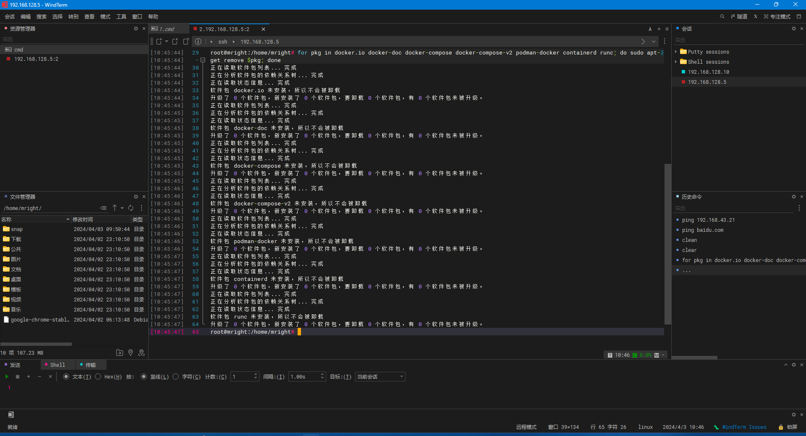
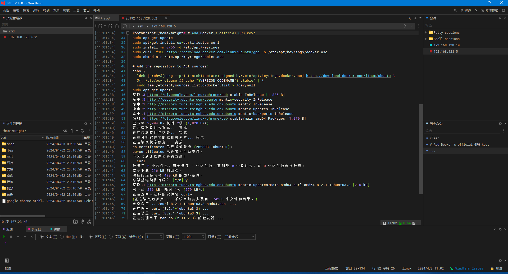
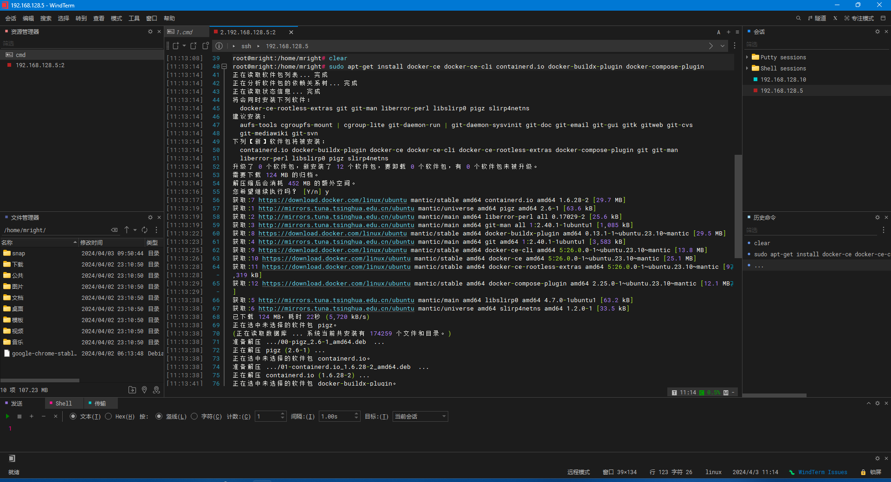
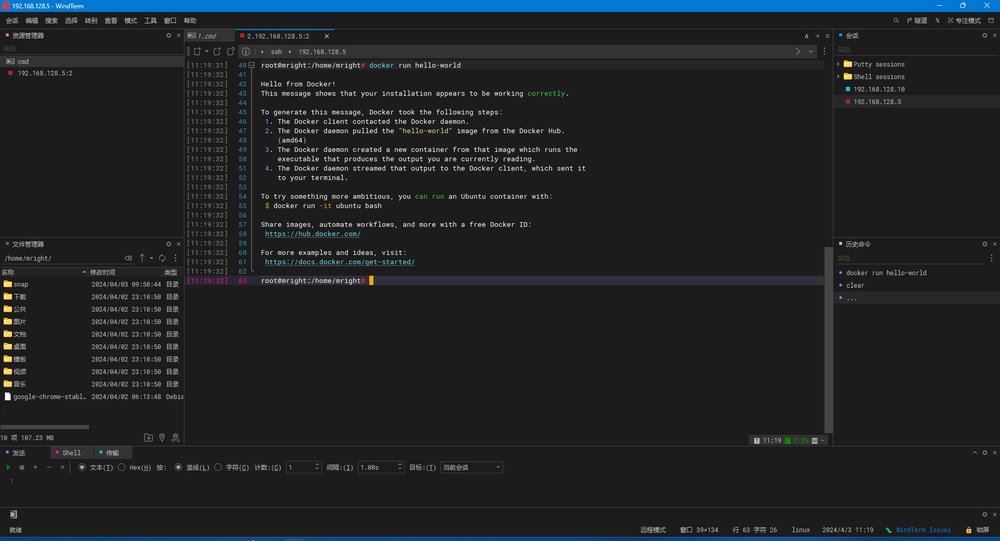

本节将阐述在Linux操作系统上安装Docker Engine，亦称Docker CE（Community Edition）。值得注意的是，Docker Engine也可以通过适用于Windows、macOS和Linux的Docker Desktop进行安装。

有关如何安装 Docker Desktop 的说明，请参阅：

- [适用于 Linux 的 Docker 桌面](https://docs.docker.com/desktop/install/linux-install/)
- [适用于 Mac (macOS) 的 Docker 桌面](https://docs.docker.com/desktop/install/mac-install/)
- [适用于 Windows 的 Docker 桌面](https://docs.docker.com/desktop/install/windows-install/)

# 支持架构

|架构|x86_64/amd64|arm64/aarch64|arm(32-bit)|ppc64le|s390|
|---|---|---|---|---|---|
|CentOS|√|√| |√| |
|Debian|√|√|√|√| |
|Fedora|√|√| |√| |
|Raspberry Pi OS (32-bit)| | |√| | |
|RHEL (s390x)| | | | |√|
|SLES| | | | |√|
|Ubuntu|√|√|√|√|√|
|Binaries|√|√|√| | |

**注意：**
```info
若您使用 ufw 或 firewalld 等工具管理防火墙设置，请注意，当您使用 Docker 公开容器端口时，这些端口将绕过您所设定的防火墙规则。
```
# 安装前准备

## OS需求

* Ubuntu Mantic 23.10
* Ubuntu Jammy 22.04 (LTS)
* Ubuntu Focal 20.04 (LTS)

适用于Ubuntu的docker CE几乎兼容所有架构。

## 卸载老旧版本的 docker 引擎

在安装 Docker Engine 之前，您需要卸载所有与之冲突的软件包。对于非官方的 Docker 软件包，Distro 维护者在 APT 中提供了其非官方发行版。您必须首先卸载这些软件包，然后才能安装正式版本的 Docker Engine。

需要卸载的非官方软件包包括：

* `docker.io`
* `docker-compose`
* `docker-compose-v2`
* `docker-doc`
* `podman-docker`

此外，Docker Engine 还依赖于 containerd 和 runc。Docker 引擎将这些依赖项捆绑为一个捆绑包：containerd.io。如果您之前安装过 containerd 或 runc，请务必卸载它们，以避免与 Docker Engine 捆绑的版本发生冲突。
```
# 下列命令同行
for pkg in docker.io docker-doc docker-compose docker-compose-v2 podman-docker containerd runc;do sudo apt-get remove $pkg; done
```



`apt-get`可能会报告您没有安装这些软件包。

`/var/lib/docker/`卸载 Docker 时，不会自动删除存储的镜像、容器、卷和网络。

## 使用 apt 存储库安装
在新终端上首次安装 Docker Engine 之前，需要设置 Docker 存储库。之后，您可以从存储库安装和更新 Docker。

1. 设置 Docker 的`apt`存储库。 

```insert
# Add Docker's official GPG key:
sudo apt-get update
sudo apt-get install ca-certificates curl
sudo install -m 0755 -d /etc/apt/keyrings
sudo curl -fsSL https://download.docker.com/linux/ubuntu/gpg -o /etc/apt/keyrings/docker.asc
sudo chmod a+r /etc/apt/keyrings/docker.asc

# Add the repository to Apt sources:
echo \
  "deb [arch=$(dpkg --print-architecture) signed-by=/etc/apt/keyrings/docker.asc] https://download.docker.com/linux/ubuntu \
  $(. /etc/os-release && echo "$VERSION_CODENAME") stable" | \
  sudo tee /etc/apt/sources.list.d/docker.list > /dev/null
sudo apt-get update
```


2. 安装 docker CE

```
# 最新版本
sudo apt-get install docker-ce docker-ce-cli containerd.io docker-buildx-plugin docker-compose-plugin
# 具体版本
##要安装特定版本的 Docker Engine，请首先列出存储库中的可用版本：
### List the available versions:
apt-cache madison docker-ce | awk '{ print $3 }'

5:24.0.0-1~ubuntu.22.04~jammy
5:23.0.6-1~ubuntu.22.04~jammy
...
###选择所需的版本并安装：
sudo docker run hello-world
```


3. 通过运行镜像来验证Docker Engine安装是否成功 `hello-world`。

```
sudo docker run hello-world
```
这个命令会在 Docker 中启动一个名为 hello-world 的容器，该容器会执行一些测试操作并输出一条消息，用于确认 Docker 已正确安装和运行。



**注意**
在缺乏 root 权限的情况下尝试运行 Docker 命令可能会导致权限错误。尽管 docker 用户组已存在，但其中不包含任何用户，这意味着您需要使用 sudo 权限来执行 Docker 命令。在继续 Linux 安装后，可以通过一些可选配置步骤来允许非特权用户执行 Docker 命令。